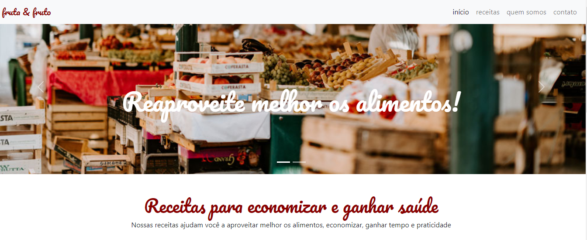

# Bootstrap

### Projeto desenvolvido para o curso de *Bootstrap: Criando uma landing page responsiva* da instrutora Juliana Amoasei (Alura).

&nbsp;

Objetivos do curso:

- Utilizar os componentes prontos de navbar, carrossel, cards e modais para criar sites responsivos automaticamente;
- Usar o método de desenvolvimento front-end para que as aplicações sejam sempre responsivas, simples e funcionais independente do dispositivo;
- Produzir um código HTML e CSS semântico e de qualidade para que leitores de tela e robôs de busca consigam ler bem o seu site;
- Padronizar os componentes do site ou aplicação web.

&nbsp;

### [Link para o site do Bootstrap](https://getbootstrap.com/)

&nbsp;

Clique na imagem para visualizar o site:

